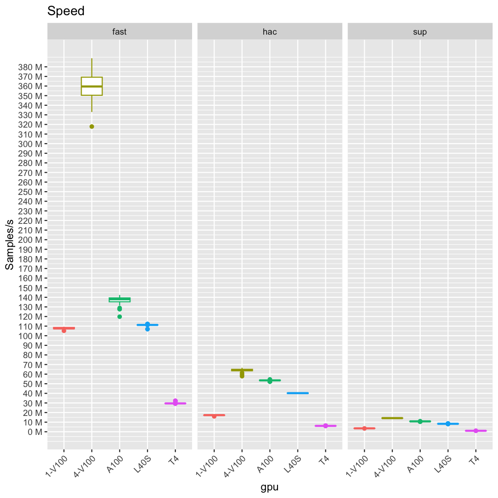
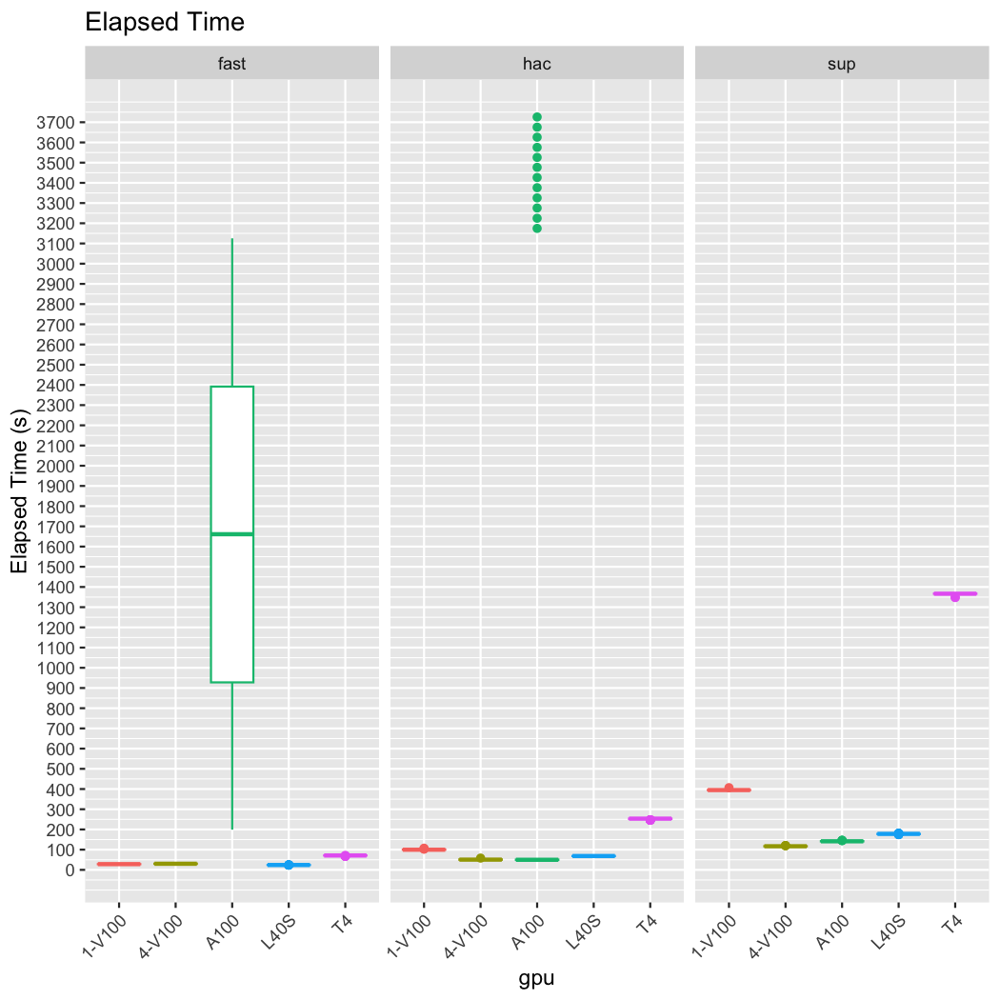

README
================

## NVIDIA GPUs Benchmarking with dorado

**Devices**:

- 01 V100

- 04 V100

- 01 L40S

- 01 A100

- 01 T4

**Input dataset:** 80415 Kleb R10 reads

**Setting**: - `dorado 0.4.3` with three models
`dna_r10.4.1_e8.2_400bps_fast@v4.2.0`,
`dna_r10.4.1_e8.2_400bps_hac@v4.2.0`, and
`dna_r10.4.1_e8.2_400bps_sup@v4.2.0`

- Basecalling for each model is replicated with 100 iterations, see
  `scripts`
  - `benchmark.sh`
  - `collate-logs.py`

**Results**:

| gpu    | model |       mean |     median |         sd |
|:-------|:------|-----------:|-----------:|-----------:|
| 1-V100 | fast  | 107.939818 | 107.640500 |  1.0647929 |
| 1-V100 | hac   |  17.202989 |  17.322450 |  0.2287823 |
| 1-V100 | sup   |   3.571426 |   3.572158 |  0.0102934 |
| 4-V100 | fast  | 358.610410 | 359.536300 | 12.4196079 |
| 4-V100 | hac   |  64.213208 |  64.136780 |  1.3068442 |
| 4-V100 | sup   |  14.203581 |  14.199730 |  0.0093489 |
| A100   | fast  | 137.042506 | 137.969850 |  3.4711558 |
| A100   | hac   |  53.481533 |  53.522705 |  0.5226483 |
| A100   | sup   |  10.811802 |  10.822560 |  0.0614872 |
| L40S   | fast  | 111.186470 | 111.214800 |  0.6627688 |
| L40S   | hac   |  40.173250 |  40.228280 |  0.3773101 |
| L40S   | sup   |   8.314422 |   8.296941 |  0.0686721 |
| T4     | fast  |  29.666326 |  29.523540 |  0.5780668 |
| T4     | hac   |   6.122082 |   6.111753 |  0.0547272 |
| T4     | sup   |   1.010894 |   1.010712 |  0.0021719 |

Million samples/s

The higher the number, the better.

> Generated by Quarto
